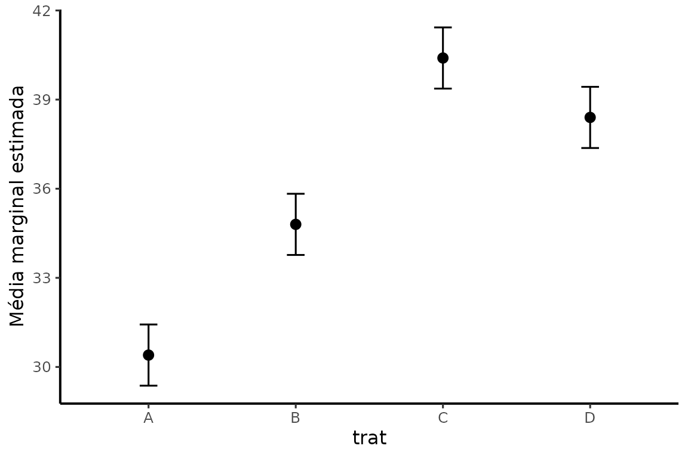
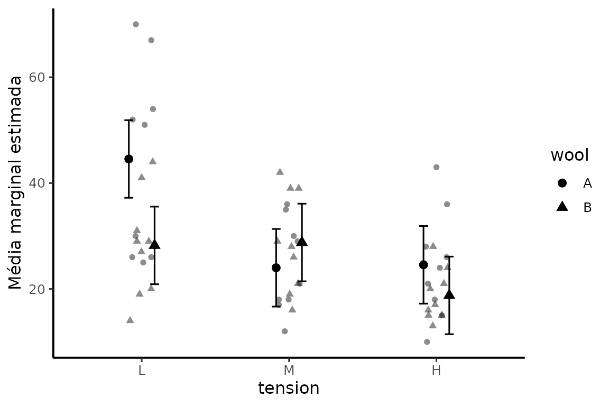

# Médias marginais estimadas e contrastes

## Preparação

``` r

dados <- data.frame(
  trat = factor(rep(c("A", "B", "C", "D"), each = 5)),
  bloco = factor(rep(1:5, times = 4)),
  altura = c(30,31,29,32,30, 35,34,36,35,34, 40,39,41,42,40, 38,37,39,38,40),
  massa = c(10,11,10,9,10, 12,13,12,12,11, 16,15,17,16,16, 14,15,14,13,14)
)
m_altura <- lm(altura ~ bloco + trat, data = dados)
m_massa <- lm(massa ~ bloco + trat, data = dados)
mods <- list(altura = m_altura, massa = m_massa)
```

## `emmeans_lista()`

### Exemplo 1: duas respostas

``` r

lista_emm <- emmeans_lista(mods, ~ trat)
lista_emm
#> $altura
#>  trat emmean    SE df lower.CL upper.CL
#>  A      30.4 0.473 12     29.4     31.4
#>  B      34.8 0.473 12     33.8     35.8
#>  C      40.4 0.473 12     39.4     41.4
#>  D      38.4 0.473 12     37.4     39.4
#> 
#> Results are averaged over the levels of: bloco 
#> Confidence level used: 0.95 
#> 
#> $massa
#>  trat emmean    SE df lower.CL upper.CL
#>  A        10 0.303 12     9.34     10.7
#>  B        12 0.303 12    11.34     12.7
#>  C        16 0.303 12    15.34     16.7
#>  D        14 0.303 12    13.34     14.7
#> 
#> Results are averaged over the levels of: bloco 
#> Confidence level used: 0.95
```

### Exemplo 2: selecionar um modelo

``` r

emmeans_lista(mods, ~ trat, which = 2)
#> $massa
#>  trat emmean    SE df lower.CL upper.CL
#>  A        10 0.303 12     9.34     10.7
#>  B        12 0.303 12    11.34     12.7
#>  C        16 0.303 12    15.34     16.7
#>  D        14 0.303 12    13.34     14.7
#> 
#> Results are averaged over the levels of: bloco 
#> Confidence level used: 0.95
```

### Exemplo 3: GLM na escala de resposta

``` r

mp <- glm(breaks ~ wool * tension, poisson, data = warpbreaks)
emmeans_lista(list(quebras = mp), ~ tension | wool, type = "response")
#> $quebras
#> wool = A:
#>  tension rate   SE  df asymp.LCL asymp.UCL
#>  L       44.6 2.22 Inf      40.4      49.1
#>  M       24.0 1.63 Inf      21.0      27.4
#>  H       24.6 1.65 Inf      21.5      28.0
#> 
#> wool = B:
#>  tension rate   SE  df asymp.LCL asymp.UCL
#>  L       28.2 1.77 Inf      25.0      31.9
#>  M       28.8 1.79 Inf      25.5      32.5
#>  H       18.8 1.44 Inf      16.1      21.8
#> 
#> Confidence level used: 0.95 
#> Intervals are back-transformed from the log scale
```

## `contrast_lista()`

### Exemplo 1: Tukey

``` r

contrast_lista(lista_emm, method = "pairwise", adjust = "tukey")
#> $altura
#>  contrast estimate    SE df t.ratio p.value
#>  A - B        -4.4 0.668 12  -6.584  0.0001
#>  A - C       -10.0 0.668 12 -14.963 <0.0001
#>  A - D        -8.0 0.668 12 -11.970 <0.0001
#>  B - C        -5.6 0.668 12  -8.379 <0.0001
#>  B - D        -3.6 0.668 12  -5.387  0.0008
#>  C - D         2.0 0.668 12   2.993  0.0480
#> 
#> Results are averaged over the levels of: bloco 
#> P value adjustment: tukey method for comparing a family of 4 estimates 
#> 
#> $massa
#>  contrast estimate    SE df t.ratio p.value
#>  A - B          -2 0.428 12  -4.671  0.0026
#>  A - C          -6 0.428 12 -14.013 <0.0001
#>  A - D          -4 0.428 12  -9.342 <0.0001
#>  B - C          -4 0.428 12  -9.342 <0.0001
#>  B - D          -2 0.428 12  -4.671  0.0026
#>  C - D           2 0.428 12   4.671  0.0026
#> 
#> Results are averaged over the levels of: bloco 
#> P value adjustment: tukey method for comparing a family of 4 estimates
```

### Exemplo 2: tratamento versus controle

``` r

contrast_lista(lista_emm, method = "trt.vs.ctrl", ref = 1, adjust = "dunnettx")
#> $altura
#>  contrast estimate    SE df t.ratio p.value
#>  B - A         4.4 0.668 12   6.584 <0.0001
#>  C - A        10.0 0.668 12  14.963 <0.0001
#>  D - A         8.0 0.668 12  11.970 <0.0001
#> 
#> Results are averaged over the levels of: bloco 
#> P value adjustment: dunnettx method for 3 tests 
#> 
#> $massa
#>  contrast estimate    SE df t.ratio p.value
#>  B - A           2 0.428 12   4.671  0.0015
#>  C - A           6 0.428 12  14.013 <0.0001
#>  D - A           4 0.428 12   9.342 <0.0001
#> 
#> Results are averaged over the levels of: bloco 
#> P value adjustment: dunnettx method for 3 tests
```

### Exemplo 3: contraste planejado

``` r

coef <- list("A vs demais" = c(-3, 1, 1, 1))
contrast_lista(lista_emm, method = coef, adjust = "none")
#> $altura
#>  contrast    estimate   SE df t.ratio p.value
#>  A vs demais     22.4 1.64 12  13.683 <0.0001
#> 
#> Results are averaged over the levels of: bloco 
#> 
#> $massa
#>  contrast    estimate   SE df t.ratio p.value
#>  A vs demais       12 1.05 12  11.442 <0.0001
#> 
#> Results are averaged over the levels of: bloco
```

## `cld_lista()`

As letras são uma forma compacta de apresentar comparações, mas não
devem ser interpretadas como prova de igualdade.

### Exemplo 1

``` r

cld_lista(lista_emm, adjust = "tukey")
```

### Exemplo 2

``` r

cld_lista(lista_emm, which = 1, adjust = "tukey")
```

### Exemplo 3: margem de equivalência definida pelo pesquisador

``` r

cld_lista(lista_emm, adjust = "tukey", delta = 1.0)
```

## `comparar_emmeans()`

A função conserva o `emmGrid` e reúne tabela de médias, intervalos e
contrastes.

### Exemplo 1: Tukey

``` r

cmp1 <- comparar_emmeans(m_altura, ~ trat, method = "pairwise", adjust = "tukey")
cmp1
#> Médias marginais estimadas
#> --------------------------
#>  trat emmean        SE df lower.CL upper.CL
#>  A      30.4 0.4725816 12 29.37033 31.42967
#>  B      34.8 0.4725816 12 33.77033 35.82967
#>  C      40.4 0.4725816 12 39.37033 41.42967
#>  D      38.4 0.4725816 12 37.37033 39.42967
#> 
#> Results are averaged over the levels of: bloco 
#> Confidence level used: 0.95 
#> 
#> Contrastes:
#>  contrast estimate        SE df   lower.CL  upper.CL t.ratio p.value
#>  A - B        -4.4 0.6683313 12  -6.384209 -2.415791  -6.584  0.0001
#>  A - C       -10.0 0.6683313 12 -11.984209 -8.015791 -14.963 <0.0001
#>  A - D        -8.0 0.6683313 12  -9.984209 -6.015791 -11.970 <0.0001
#>  B - C        -5.6 0.6683313 12  -7.584209 -3.615791  -8.379 <0.0001
#>  B - D        -3.6 0.6683313 12  -5.584209 -1.615791  -5.387  0.0008
#>  C - D         2.0 0.6683313 12   0.015791  3.984209   2.993  0.0480
#> 
#> Results are averaged over the levels of: bloco 
#> Confidence level used: 0.95 
#> Conf-level adjustment: tukey method for comparing a family of 4 estimates 
#> P value adjustment: tukey method for comparing a family of 4 estimates
```

### Exemplo 2: Dunnett

``` r

cmp2 <- comparar_emmeans(
  m_altura,
  ~ trat,
  method = "trt.vs.ctrl",
  adjust = "dunnettx",
  ref = 1
)
cmp2$contrastes
#>  contrast estimate        SE df lower.CL  upper.CL t.ratio p.value
#>  B - A         4.4 0.6683313 12 2.592182  6.207818   6.584 <0.0001
#>  C - A        10.0 0.6683313 12 8.192182 11.807818  14.963 <0.0001
#>  D - A         8.0 0.6683313 12 6.192182  9.807818  11.970 <0.0001
#> 
#> Results are averaged over the levels of: bloco 
#> Confidence level used: 0.95 
#> Conf-level adjustment: dunnettx method for 3 estimates 
#> P value adjustment: dunnettx method for 3 tests
```

### Exemplo 3: comparações simples em interação

``` r

m_int <- lm(breaks ~ wool * tension, data = warpbreaks)
cmp3 <- comparar_emmeans(m_int, ~ tension | wool, method = "pairwise", adjust = "tukey")
cmp3$estimativas
#> wool = A:
#>  tension   emmean       SE df lower.CL upper.CL
#>  L       44.55556 3.646761 48 37.22325 51.88786
#>  M       24.00000 3.646761 48 16.66769 31.33231
#>  H       24.55556 3.646761 48 17.22325 31.88786
#> 
#> wool = B:
#>  tension   emmean       SE df lower.CL upper.CL
#>  L       28.22222 3.646761 48 20.88992 35.55453
#>  M       28.77778 3.646761 48 21.44547 36.11008
#>  H       18.77778 3.646761 48 11.44547 26.11008
#> 
#> Confidence level used: 0.95
```

## `plot_emmeans()`

### Exemplo 1: EMMs e IC

``` r

plot_emmeans(cmp1)
```



### Exemplo 2: dados observados e EMMs

``` r

plot_emmeans(cmp1, data = dados, x = trat, y = altura)
```


### Exemplo 3: interação

``` r

plot_emmeans(cmp3, data = warpbreaks, x = tension, y = breaks)
```



## `contraste_poly()`

Esta função foi criada para reduzir um problema frequente em ensaios
quantitativos: contrastes polinomiais construídos apenas pela ordem dos
níveis podem não representar a escala real quando o espaçamento entre
doses é irregular.

### Exemplo 1: níveis igualmente espaçados

``` r

d1 <- data.frame(dose = factor(rep(c(0, 50, 100, 150), each = 4)), y = 1:16)
m1 <- lm(y ~ dose, data = d1)
em1 <- emmeans::emmeans(m1, ~ dose)
contraste_poly(em1, scores = c(0, 50, 100, 150))
#> Contrastes polinomiais
#> -----------------------
#> Método: opoly
#> Escores: 0=0, 50=50, 100=100, 150=150
#> Espaçamento regular: sim
#> 
#>  contrast  estimate        SE df  lower.CL  upper.CL t.ratio p.value
#>  linear    8.944272 0.6454972 12  7.537854 10.350690  13.856 <0.0001
#>  quadratic 0.000000 0.6454972 12 -1.406418  1.406418   0.000  1.0000
#>  cubic     0.000000 0.6454972 12 -1.406418  1.406418   0.000  1.0000
#> 
#> Confidence level used: 0.95
```

### Exemplo 2: níveis desigualmente espaçados

``` r

d2 <- data.frame(dose = factor(rep(c(0, 25, 100, 200), each = 4)), y = 1:16)
m2 <- lm(y ~ dose, data = d2)
em2 <- emmeans::emmeans(m2, ~ dose)
cp2 <- contraste_poly(em2, scores = c(0, 25, 100, 200))
cp2$scores
#>   0  25 100 200 
#>   0  25 100 200
cp2$igualmente_espacados
#> [1] FALSE
```

### Exemplo 3: limitar ao quadrático

``` r

contraste_poly(em1, scores = c(0, 50, 100, 150), degree = 2)
#> Contrastes polinomiais
#> -----------------------
#> Método: opoly
#> Escores: 0=0, 50=50, 100=100, 150=150
#> Espaçamento regular: sim
#> 
#>  contrast  estimate        SE df  lower.CL  upper.CL t.ratio p.value
#>  linear    8.944272 0.6454972 12  7.537854 10.350690  13.856 <0.0001
#>  quadratic 0.000000 0.6454972 12 -1.406418  1.406418   0.000  1.0000
#> 
#> Confidence level used: 0.95
```

`normalized = TRUE` usa `opoly`. `normalized = FALSE` só é aceito quando
os escores são igualmente espaçados.
