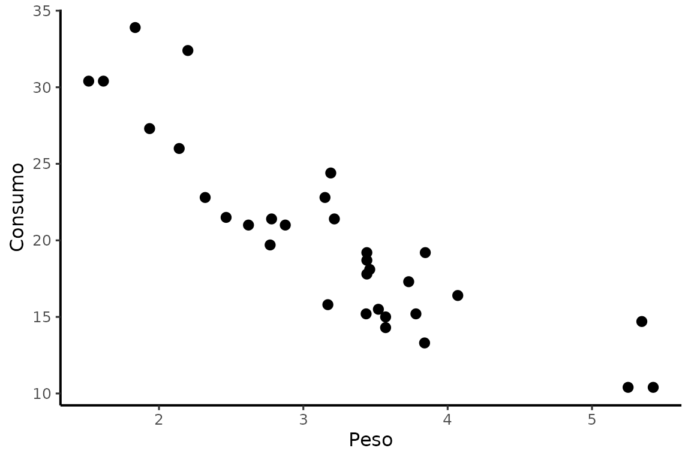
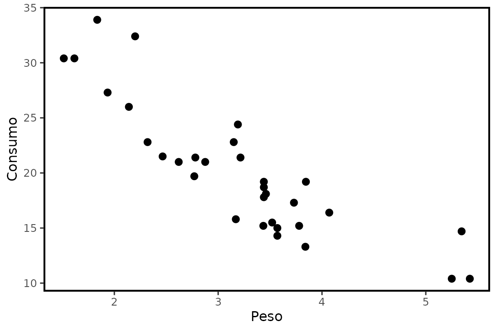
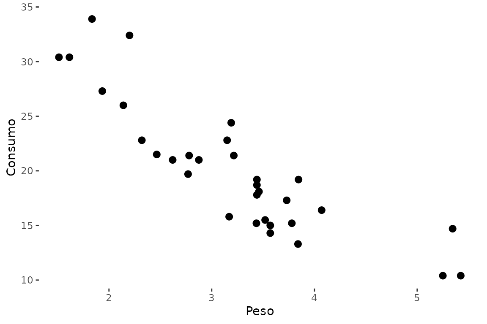

# Temas e exportação de figuras científicas

## Temas

``` r

p <- ggplot2::ggplot(mtcars, ggplot2::aes(wt, mpg)) +
  ggplot2::geom_point(size = 2.5) +
  ggplot2::labs(x = "Peso", y = "Consumo")
```

### `theme_nogrid()`

``` r

p + theme_nogrid()
```



### `theme_nogridacp()`

``` r

p + theme_nogridacp()
```



### `theme_transparent()` e `trans`

``` r

p + trans
```



``` r

theme_transparent()
#> <theme> List of 6
#>  $ legend.background    : <ggplot2::element_rect>
#>   ..@ fill         : chr "transparent"
#>   ..@ colour       : NULL
#>   ..@ linewidth    : NULL
#>   ..@ linetype     : NULL
#>   ..@ linejoin     : NULL
#>   ..@ inherit.blank: logi FALSE
#>  $ legend.box.background: <ggplot2::element_rect>
#>   ..@ fill         : chr "transparent"
#>   ..@ colour       : NULL
#>   ..@ linewidth    : NULL
#>   ..@ linetype     : NULL
#>   ..@ linejoin     : NULL
#>   ..@ inherit.blank: logi FALSE
#>  $ panel.background     : <ggplot2::element_rect>
#>   ..@ fill         : chr "transparent"
#>   ..@ colour       : NULL
#>   ..@ linewidth    : NULL
#>   ..@ linetype     : NULL
#>   ..@ linejoin     : NULL
#>   ..@ inherit.blank: logi FALSE
#>  $ panel.grid.major     : <ggplot2::element_blank>
#>  $ panel.grid.minor     : <ggplot2::element_blank>
#>  $ plot.background      : <ggplot2::element_rect>
#>   ..@ fill         : chr "transparent"
#>   ..@ colour       : logi NA
#>   ..@ linewidth    : NULL
#>   ..@ linetype     : NULL
#>   ..@ linejoin     : NULL
#>   ..@ inherit.blank: logi FALSE
#>  @ complete: logi FALSE
#>  @ validate: logi TRUE
```

## `ExportTimes()`

A função exporta uma figura individual. Os padrões históricos são 20 ×
15 cm e 600 dpi para os formatos raster, mas todos esses valores podem
ser alterados.

### Exemplo 1: PNG e SVG

``` r

ExportTimes(
  p + theme_nogrid(),
  "figuras/Figura_1",
  formats = c("png", "svg")
)
```

### Exemplo 2: TIFF

``` r

ExportTimes(
  p + theme_nogrid(),
  "figuras/Figura_1",
  formats = "tiff",
  compression = "lzw"
)
```

### Exemplo 3: fundo transparente

``` r

ExportTimes(
  p + trans,
  "figuras/Figura_transparente",
  formats = c("png", "svg"),
  bg = "transparent"
)
```

## `export_figuras()`

A função aplica
[`ExportTimes()`](https://wep69.github.io/myfuns/reference/ExportTimes.md)
a uma lista nomeada.

``` r

p2 <- ggplot2::ggplot(iris, ggplot2::aes(Species, Sepal.Length)) +
  ggplot2::geom_boxplot() + theme_nogrid()
```

### Exemplo 1

``` r

export_figuras(list(fig1 = p, fig2 = p2), "figuras", formats = "png")
```

### Exemplo 2

``` r

export_figuras(list(fig1 = p, fig2 = p2), "figuras", formats = c("png", "tiff", "svg"))
```

### Exemplo 3

``` r

export_figuras(
  list(fig1 = p + trans, fig2 = p2 + trans),
  "figuras_transparentes",
  formats = c("png", "svg"),
  bg = "transparent"
)
```

## Recomendações de uso

Para variáveis contínuas, prefira mostrar observações ou distribuição
juntamente com estimativas e incerteza.
[`plot_emmeans()`](https://wep69.github.io/myfuns/reference/plot_emmeans.md)
e [`plot_reg()`](https://wep69.github.io/myfuns/reference/plot_reg.md)
foram adicionadas justamente para facilitar esse padrão de apresentação.
