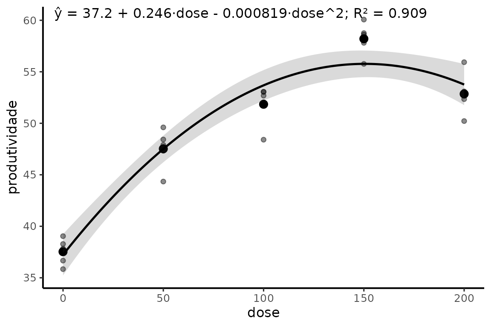
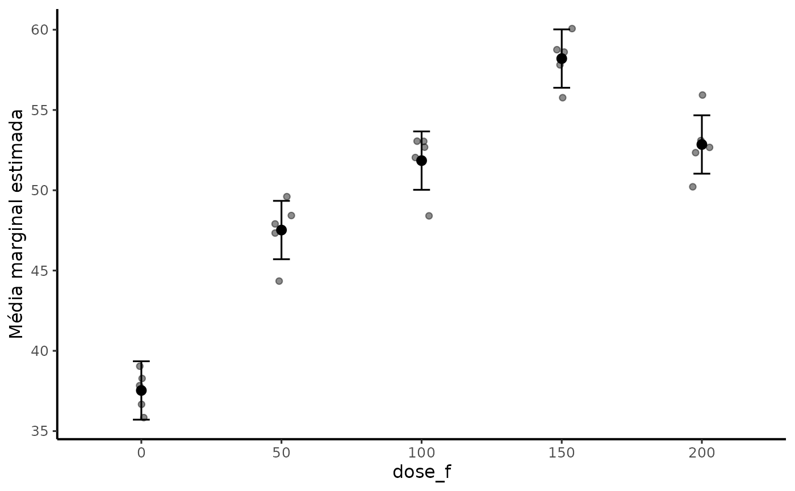

# Introdução ao myfuns 0.5.0

## Finalidade

`myfuns` é uma camada de apoio para análise estatística aplicada à
experimentação agrícola. A versão 0.5.0 preserva as funções históricas e
acrescenta vinte funções para auditoria de delineamentos, descrição,
ANOVA, `emmeans`, regressão quantitativa, diagnóstico, modelos mistos,
contagens, PCA, Bayes e exportação de figuras.

A filosofia do pacote é auxiliar o fluxo de trabalho sem substituir
decisões científicas. Nenhuma função seleciona tratamento, modelo,
distribuição ou grau polinomial apenas com base em um valor de p.

## Organização funcional

| Etapa | Funções principais |
|----|----|
| Verificação do banco | [`auditar_delineamento()`](https://wep69.github.io/myfuns/reference/auditar_delineamento.md), [`resumo_agri()`](https://wep69.github.io/myfuns/reference/resumo_agri.md) |
| ANOVA | [`anovaCV()`](https://wep69.github.io/myfuns/reference/anovaCV.md), [`anova_agri()`](https://wep69.github.io/myfuns/reference/anova_agri.md) |
| Médias e contrastes | [`emmeans_lista()`](https://wep69.github.io/myfuns/reference/emmeans_lista.md), [`comparar_emmeans()`](https://wep69.github.io/myfuns/reference/comparar_emmeans.md), [`contrast_lista()`](https://wep69.github.io/myfuns/reference/list_helpers.md), [`cld_lista()`](https://wep69.github.io/myfuns/reference/list_helpers.md), [`contraste_poly()`](https://wep69.github.io/myfuns/reference/contraste_poly.md) |
| Fatores quantitativos | [`reg_poly()`](https://wep69.github.io/myfuns/reference/reg_poly.md), [`ponto_critico()`](https://wep69.github.io/myfuns/reference/ponto_critico.md), [`equar2()`](https://wep69.github.io/myfuns/reference/equar2.md), [`plot_reg()`](https://wep69.github.io/myfuns/reference/plot_reg.md) |
| Diagnóstico | [`diagnostico_modelo()`](https://wep69.github.io/myfuns/reference/diagnostico_modelo.md), [`diagnostico_contagem()`](https://wep69.github.io/myfuns/reference/diagnostico_contagem.md) |
| Modelos mistos | [`resumo_misto()`](https://wep69.github.io/myfuns/reference/resumo_misto.md) |
| Comparação de modelos | [`comparar_modelos()`](https://wep69.github.io/myfuns/reference/comparar_modelos.md) |
| PCA | [`pca_agri()`](https://wep69.github.io/myfuns/reference/pca_agri.md), [`plot_pca_agri()`](https://wep69.github.io/myfuns/reference/plot_pca_agri.md) |
| Bayes | [`resumo_bayes()`](https://wep69.github.io/myfuns/reference/resumo_bayes.md) |
| Gráficos | [`plot_emmeans()`](https://wep69.github.io/myfuns/reference/plot_emmeans.md), [`theme_nogrid()`](https://wep69.github.io/myfuns/reference/themes.md), [`theme_nogridacp()`](https://wep69.github.io/myfuns/reference/themes.md), [`theme_transparent()`](https://wep69.github.io/myfuns/reference/themes.md), `trans` |
| Exportação | [`ExportTimes()`](https://wep69.github.io/myfuns/reference/ExportTimes.md), [`export_figuras()`](https://wep69.github.io/myfuns/reference/export_figuras.md) |
| Área de transferência | [`read_clipboard_table()`](https://wep69.github.io/myfuns/reference/read_clipboard_table.md), [`write_clipboard_table()`](https://wep69.github.io/myfuns/reference/write_clipboard_table.md) e aliases históricos |

## Exemplo integrado: delineamento em blocos com doses

``` r

set.seed(2026)
dados <- expand.grid(
  bloco = factor(1:5),
  dose = c(0, 50, 100, 150, 200)
)
dados$produtividade <- with(
  dados,
  40 + 0.20 * dose - 0.00065 * dose^2 +
    rep(c(-2, 1, 0, 2, -1), each = 5) +
    rnorm(nrow(dados), 0, 2)
)
```

### 1. Auditar antes de modelar

``` r

auditar_delineamento(
  dados,
  tratamento = dose,
  bloco = bloco,
  resposta = produtividade
)
#> Auditoria do delineamento
#> -------------------------
#>                         item valor
#>                  Observações    25
#>    Variáveis do delineamento     2
#>             Células ausentes     0
#>  Linhas em chaves duplicadas     0
#>           Respostas ausentes     0
#>                   Balanceado     1
#> 
#> Mensagens:
#> * Duplicação de unidade experimental não foi avaliada porque `unidade` não foi informada.
```

### 2. Resumir os dados observados

``` r

resumo_agri(dados, produtividade, dose)
#>   dose n n_total n_ausentes    media       dp erro_padrao ic_inferior
#> 1    0 5       5          0 37.53150 1.278029   0.5715517    35.94462
#> 2   50 5       5          0 47.52236 1.964391   0.8785025    45.08325
#> 3  100 5       5          0 51.84689 1.967442   0.8798666    49.40399
#> 4  150 5       5          0 58.20140 1.584726   0.7087110    56.23370
#> 5  200 5       5          0 52.85146 2.048481   0.9161087    50.30793
#>   ic_superior  mediana       q1       q3   minimo   maximo       cv
#> 1    39.11838 37.83050 36.66672 38.27848 35.84062 39.04118 3.405216
#> 2    49.96148 47.90471 47.33476 48.42742 44.34282 49.60211 4.133615
#> 3    54.28979 52.68357 52.03913 53.04837 48.40624 53.05713 3.794715
#> 4    60.16910 58.60782 57.81013 58.75449 55.76556 60.06900 2.722831
#> 5    55.39499 52.67064 52.34266 53.09641 50.21594 55.93165 3.875922
```

### 3. Ajustar o fator quantitativo

``` r

rp <- reg_poly(dados, produtividade, dose, degree = 1:2)
rp
#> Regressão polinomial
#> --------------------
#> Resposta: produtividade
#> Preditor: dose
#> Modelo principal para predição: grau 2
#> 
#> Comparação descritiva dos modelos:
#>  grau  n        R2 R2_ajustado     RMSE      AIC     AICc      BIC
#>     1 25 0.6763395   0.6622673 4.042285 146.7874 147.9303 150.4441
#>     2 25 0.9086325   0.9003264 2.147721 117.1673 119.1673 122.0428
#> 
#> Teste de falta de ajuste:
#>  grau gl_falta_ajuste SQ_falta_ajuste         F      p_valor
#>     1               3       344.21902 35.698522 3.189170e-08
#>     2               2        51.03499  7.939163 2.897199e-03
```

A tabela comparativa não representa seleção automática. O pesquisador
deve avaliar forma da resposta, falta de ajuste, incerteza, domínio
experimental, diagnóstico dos resíduos e coerência agronômica.

### 4. Obter o ponto crítico

``` r

ponto_critico(rp)
#>   x_critico y_predito classificacao dentro_intervalo ic_inferior ic_superior
#> 1  150.4741  55.76935        máximo             TRUE    135.1422    165.8059
```

### 5. Produzir a figura

``` r

plot_reg(rp)
```



## Delineamento qualitativo e médias ajustadas

``` r

dq <- transform(dados, dose_f = factor(dose))
m <- lm(produtividade ~ bloco + dose_f, data = dq)

anova_agri(m)
#> ANOVA agrícola
#> --------------
#> Analysis of Variance Table
#> 
#> Response: produtividade
#>           Df  Sum Sq Mean Sq F value    Pr(>F)    
#> bloco      4    5.45   1.363  0.3708    0.8259    
#> dose_f     4 1197.85 299.462 81.4464 1.989e-10 ***
#> Residuals 16   58.83   3.677                      
#> ---
#> Signif. codes:  0 '***' 0.001 '**' 0.01 '*' 0.05 '.' 0.1 ' ' 1
#> 
#> CV experimental: 3.87%
#> 
#> Tamanho de efeito:
#> # Effect Size for ANOVA (Type I)
#> 
#> Parameter | Eta2 (partial) |       95% CI
#> -----------------------------------------
#> bloco     |           0.08 | [0.00, 1.00]
#> dose_f    |           0.95 | [0.90, 1.00]
#> 
#> - One-sided CIs: upper bound fixed at [1.00].
cmp <- comparar_emmeans(m, ~ dose_f, method = "pairwise", adjust = "tukey")
plot_emmeans(cmp, data = dq, x = dose_f, y = produtividade)
```



## Contrastes polinomiais com doses reais

``` r

emm <- emmeans::emmeans(m, ~ dose_f)
cp <- contraste_poly(emm, scores = c(0, 50, 100, 150, 200), degree = 2)
cp
#> Contrastes polinomiais
#> -----------------------
#> Método: opoly
#> Escores: 0=0, 50=50, 100=100, 150=150, 200=200
#> Espaçamento regular: sim
#> 
#>  contrast   estimate        SE df  lower.CL  upper.CL t.ratio p.value
#>  linear    13.066202 0.8575308 16 11.248318 14.884086  15.237 <0.0001
#>  quadratic -7.657467 0.8575308 16 -9.475351 -5.839583  -8.930 <0.0001
#> 
#> Results are averaged over the levels of: bloco 
#> Confidence level used: 0.95
```

Para doses desigualmente espaçadas,
[`contraste_poly()`](https://wep69.github.io/myfuns/reference/contraste_poly.md)
usa `opoly` quando `normalized = TRUE`, preservando os valores
quantitativos informados em `scores`.

## Próximas vinhetas

Consulte as vinhetas temáticas para exemplos mais extensos:

1.  delineamento, descrição e ANOVA;
2.  médias marginais e contrastes;
3.  regressão quantitativa;
4.  diagnóstico, modelos mistos e contagens;
5.  PCA;
6.  Bayes e produtividade;
7.  gráficos e exportação.
