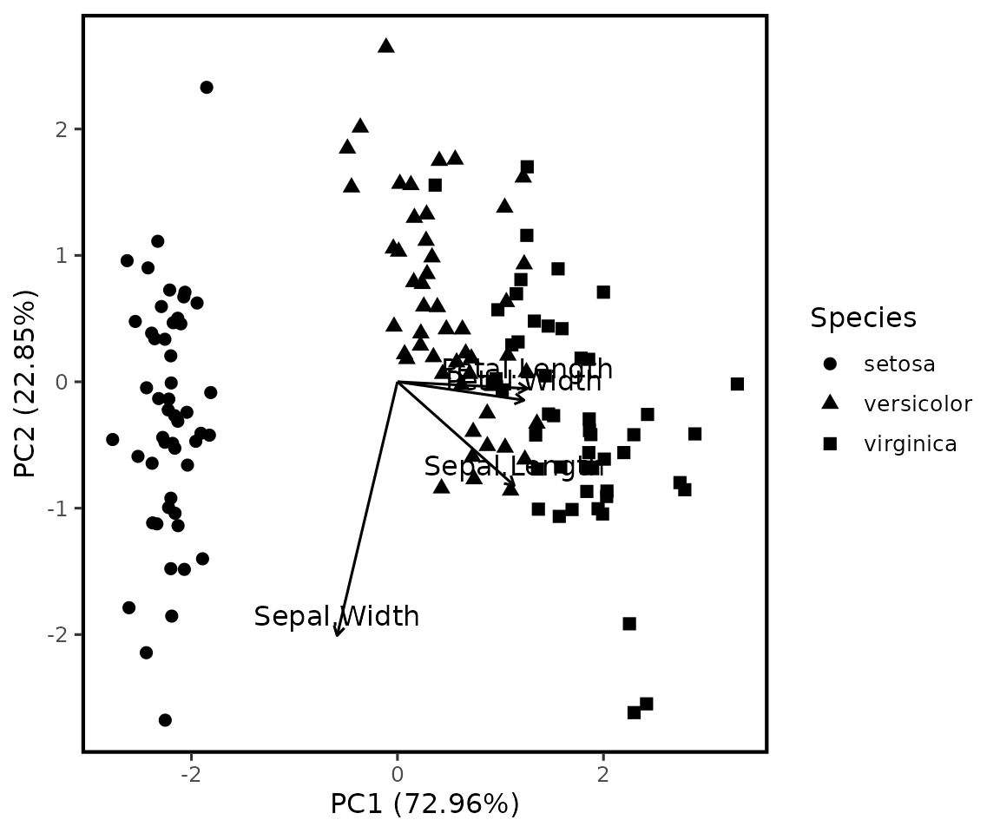
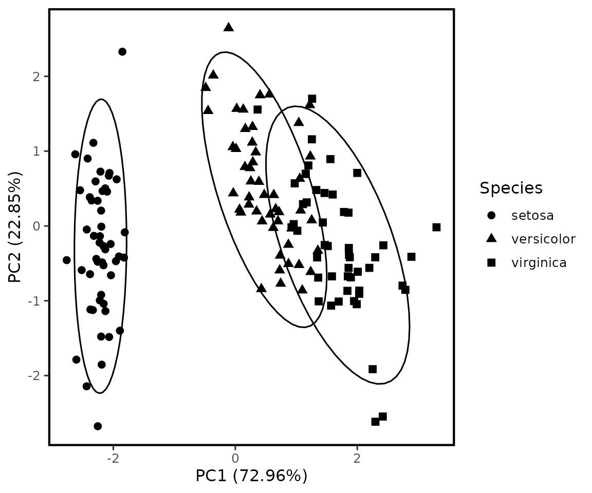
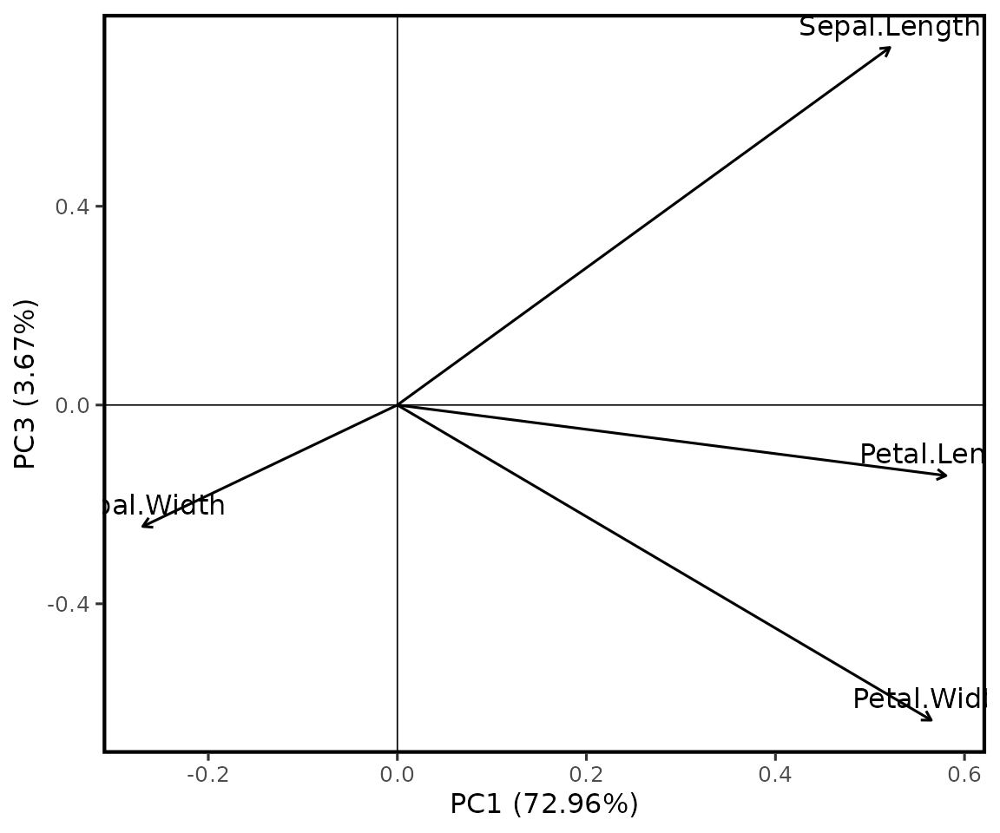

# Análise de componentes principais

## `pca_agri()`

A função utiliza
[`stats::prcomp()`](https://rdrr.io/r/stats/prcomp.html) e mantém o
objeto original. Ela não remove linhas com dados ausentes e interrompe o
ajuste quando encontra variáveis sem variabilidade.

### Exemplo 1: PCA padronizada com grupo

``` r

pca1 <- pca_agri(
  iris,
  vars = c(Sepal.Length, Sepal.Width, Petal.Length, Petal.Width),
  group = Species
)
pca1
#> Análise de componentes principais
#> ---------------------------------
#> Variáveis: Sepal.Length, Sepal.Width, Petal.Length, Petal.Width
#> Centralização: sim; padronização: sim
#> 
#>  componente  autovalor   variancia variancia_percentual variancia_acumulada
#>         PC1 2.91849782 0.729624454           72.9624454           0.7296245
#>         PC2 0.91403047 0.228507618           22.8507618           0.9581321
#>         PC3 0.14675688 0.036689219            3.6689219           0.9948213
#>         PC4 0.02071484 0.005178709            0.5178709           1.0000000
#>  acumulada_percentual
#>              72.96245
#>              95.81321
#>              99.48213
#>             100.00000
```

### Exemplo 2: sem padronização

``` r

pca2 <- pca_agri(
  iris,
  vars = c(Sepal.Length, Sepal.Width, Petal.Length, Petal.Width),
  scale = FALSE
)
pca2$variancia
#>   componente  autovalor   variancia variancia_percentual variancia_acumulada
#> 1        PC1 4.22824171 0.924618723           92.4618723           0.9246187
#> 2        PC2 0.24267075 0.053066483            5.3066483           0.9776852
#> 3        PC3 0.07820950 0.017102610            1.7102610           0.9947878
#> 4        PC4 0.02383509 0.005212184            0.5212184           1.0000000
#>   acumulada_percentual
#> 1             92.46187
#> 2             97.76852
#> 3             99.47878
#> 4            100.00000
```

### Exemplo 3: limitar componentes reportados

``` r

pca3 <- pca_agri(
  iris,
  vars = c(Sepal.Length, Sepal.Width, Petal.Length, Petal.Width),
  ncomp = 3
)
pca3$contribuicao
#>         PC1         PC2       PC3     variavel
#> 1 27.150969 14.24440565 51.777574 Sepal.Length
#> 2  7.254804 85.24748749  5.972245  Sepal.Width
#> 3 33.687936  0.05998389  2.019990 Petal.Length
#> 4 31.906291  0.44812296 40.230191  Petal.Width
```

## Componentes da saída

``` r

head(pca1$escores)
#>         PC1        PC2         PC3          PC4 .linha Species
#> 1 -2.257141 -0.4784238  0.12727962  0.024087508      1  setosa
#> 2 -2.074013  0.6718827  0.23382552  0.102662845      2  setosa
#> 3 -2.356335  0.3407664 -0.04405390  0.028282305      3  setosa
#> 4 -2.291707  0.5953999 -0.09098530 -0.065735340      4  setosa
#> 5 -2.381863 -0.6446757 -0.01568565 -0.035802870      5  setosa
#> 6 -2.068701 -1.4842053 -0.02687825  0.006586116      6  setosa
pca1$cargas
#>          PC1         PC2        PC3        PC4     variavel
#> 1  0.5210659 -0.37741762  0.7195664  0.2612863 Sepal.Length
#> 2 -0.2693474 -0.92329566 -0.2443818 -0.1235096  Sepal.Width
#> 3  0.5804131 -0.02449161 -0.1421264 -0.8014492 Petal.Length
#> 4  0.5648565 -0.06694199 -0.6342727  0.5235971  Petal.Width
pca1$variancia
#>   componente  autovalor   variancia variancia_percentual variancia_acumulada
#> 1        PC1 2.91849782 0.729624454           72.9624454           0.7296245
#> 2        PC2 0.91403047 0.228507618           22.8507618           0.9581321
#> 3        PC3 0.14675688 0.036689219            3.6689219           0.9948213
#> 4        PC4 0.02071484 0.005178709            0.5178709           1.0000000
#>   acumulada_percentual
#> 1             72.96245
#> 2             95.81321
#> 3             99.48213
#> 4            100.00000
pca1$contribuicao
#>         PC1         PC2       PC3       PC4     variavel
#> 1 27.150969 14.24440565 51.777574  6.827052 Sepal.Length
#> 2  7.254804 85.24748749  5.972245  1.525463  Sepal.Width
#> 3 33.687936  0.05998389  2.019990 64.232089 Petal.Length
#> 4 31.906291  0.44812296 40.230191 27.415396  Petal.Width
```

## `plot_pca_agri()`

### Exemplo 1: biplot

``` r

plot_pca_agri(pca1, type = "biplot")
```



### Exemplo 2: escores com elipses

``` r

plot_pca_agri(pca1, type = "scores", ellipse = TRUE)
```



### Exemplo 3: cargas PC1 × PC3

``` r

plot_pca_agri(pca3, axes = c(1, 3), type = "loadings", labels = TRUE)
```



## Interpretação

A variância explicada informa quanto da variabilidade total é
representado por cada componente. As cargas indicam associação entre
variáveis originais e componentes. A interpretação deve levar em conta a
escala das variáveis e a decisão de padronizar ou não o conjunto.
