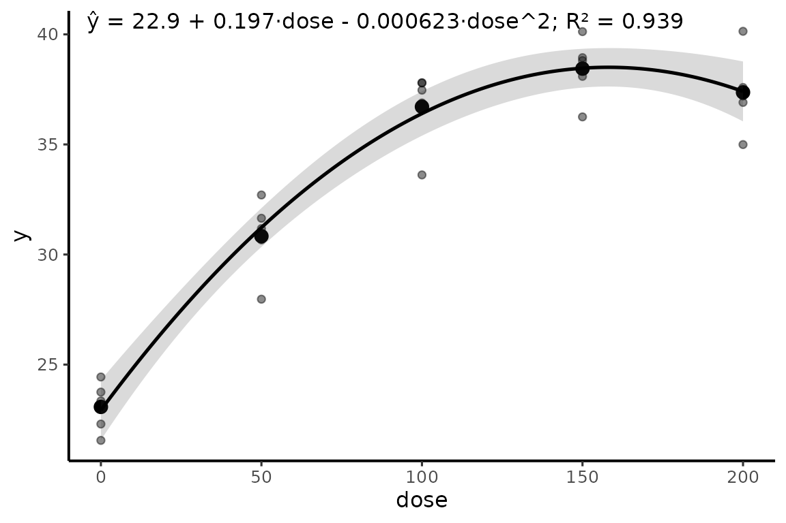
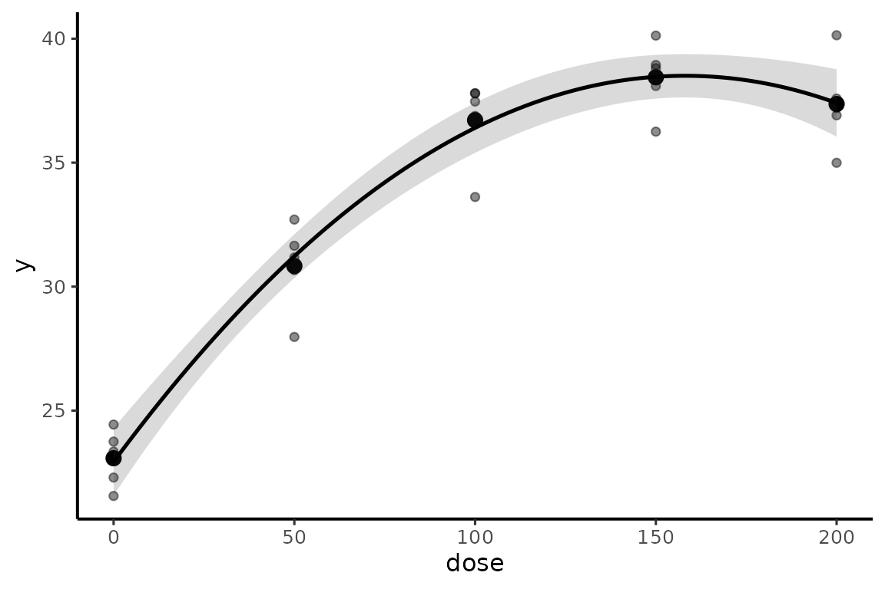

# Regressão de fatores quantitativos

## Dados

``` r

dados <- expand.grid(
  bloco = factor(1:5),
  dose = c(0, 50, 100, 150, 200)
)
dados$y <- with(
  dados,
  25 + 0.18 * dose - 0.00060 * dose^2 +
    rep(c(-1.5, 0, 1.2, -0.8, 0.5), each = 5) +
    rnorm(nrow(dados), 0, 1.8)
)
```

## `reg_poly()`

A função ajusta todos os graus solicitados e mantém todos os modelos.
Quando há vários graus, o modelo de maior grau é armazenado em `$model`
apenas para gerar predições e gráficos; isso não significa que ele tenha
sido selecionado como superior.

### Exemplo 1: linear e quadrático

``` r

rp1 <- reg_poly(dados, y, dose, degree = 1:2)
rp1
#> Regressão polinomial
#> --------------------
#> Resposta: y
#> Preditor: dose
#> Modelo principal para predição: grau 2
#> 
#> Comparação descritiva dos modelos:
#>  grau  n        R2 R2_ajustado     RMSE       AIC      AICc      BIC
#>     1 25 0.7456492   0.7345905 2.988943 131.69291 132.83577 135.3495
#>     2 25 0.9391440   0.9336116 1.462018  97.93781  99.93781 102.8133
#> 
#> Teste de falta de ajuste:
#>  grau gl_falta_ajuste SQ_falta_ajuste          F      p_valor
#>     1               3      171.275541 21.9293466 1.557752e-06
#>     2               2        1.368517  0.2628281 7.714885e-01
```

### Exemplo 2: quadrático previamente definido

``` r

rp2 <- reg_poly(dados, y, dose, degree = 2, compare = FALSE)
rp2$coeficientes$grau2
#>         termo    estimativa  erro_padrao estatistica      p_valor   ic_inferior
#> 1 (Intercept) 22.9333144017 6.559537e-01    34.96179 8.947779e-21 21.5729496183
#> 2        dose  0.1970110257 1.554057e-02    12.67721 1.375411e-11  0.1647818530
#> 3   I(dose^2) -0.0006231845 7.451134e-05    -8.36362 2.800399e-08 -0.0007777115
#>     ic_superior
#> 1 24.2936791851
#> 2  0.2292401984
#> 3 -0.0004686574
```

### Exemplo 3: explorar até cúbico

``` r

rp3 <- reg_poly(dados, y, dose, degree = 1:3)
rp3$comparacao
#>   grau  n        R2 R2_ajustado     RMSE       AIC      AICc      BIC
#> 1    1 25 0.7456492   0.7345905 2.988943 131.69291 132.83577 135.3495
#> 2    2 25 0.9391440   0.9336116 1.462018  97.93781  99.93781 102.8133
#> 3    3 25 0.9396411   0.9310184 1.456035  99.73278 102.89067 105.8272
rp3$falta_ajuste
#>   grau gl_falta_ajuste SQ_falta_ajuste          F      p_valor
#> 1    1               3      171.275541 21.9293466 1.557752e-06
#> 2    2               2        1.368517  0.2628281 7.714885e-01
#> 3    3               1        0.932054  0.3580079 5.563308e-01
```

## Teste de falta de ajuste

Quando há replicação em níveis de `x`,
[`reg_poly()`](https://wep69.github.io/myfuns/reference/reg_poly.md)
compara cada polinômio com um modelo que trata `x` como fator. O
resultado ajuda a avaliar se a forma polinomial deixa estrutura
sistemática sem explicar.

## `ponto_critico()`

### Exemplo 1: máximo quadrático

``` r

mq <- lm(y ~ dose + I(dose^2), data = dados)
ponto_critico(mq, range = range(dados$dose))
#>   x_critico y_predito classificacao dentro_intervalo ic_inferior ic_superior
#> 1   158.068  38.50388        máximo             TRUE    142.7962    173.3397
```

### Exemplo 2: checar extrapolação

``` r

ponto_critico(mq, range = c(0, 100))
#> Warning: Há ponto crítico fora do domínio informado; sua interpretação implica
#> extrapolação.
#>   x_critico y_predito classificacao dentro_intervalo ic_inferior ic_superior
#> 1   158.068  38.50388        máximo            FALSE    142.7962    173.3397
```

### Exemplo 3: diretamente do `reg_poly()`

``` r

ponto_critico(rp2)
#>   x_critico y_predito classificacao dentro_intervalo ic_inferior ic_superior
#> 1   158.068  38.50388        máximo             TRUE    142.7962    173.3397
```

O intervalo da posição do ponto quadrático é aproximado pelo método
delta. Pontos fora do intervalo experimental são explicitamente marcados
como extrapolação.

## `plot_reg()`

### Exemplo 1: curva, dados, médias e IC

``` r

plot_reg(rp2)
```


### Exemplo 2: controlar dados e variáveis

``` r

plot_reg(rp2, data = dados, x = dose, y = y, show_raw = TRUE, show_means = TRUE)
```



### Exemplo 3: sem equação

``` r

plot_reg(rp2, equation = FALSE)
```



## `equar2()` e contrastes polinomiais

[`equar2()`](https://wep69.github.io/myfuns/reference/equar2.md)
continua disponível para o fluxo histórico que usa médias por dose e os
p-valores dos contrastes linear e quadrático.

``` r

dados$dose_f <- factor(dados$dose)
mod_f <- lm(y ~ bloco + dose_f, data = dados)
emm <- emmeans::emmeans(mod_f, ~ dose_f)
cp <- contraste_poly(emm, scores = c(0, 50, 100, 150, 200), degree = 2)
medias <- aggregate(y ~ dose, data = dados, FUN = mean)
```

### Exemplo 1

``` r

equar2(medias, cp)
#> [1] "hat(y) == 22.93 + 0.197^\"**\" * x - 0.0006^\"**\" * x^2 ~ \";\" ~ R^2 == \"99.8%\""
```

### Exemplo 2: retorno detalhado

``` r

eq2 <- equar2(medias, cp, details = TRUE)
eq2$equation
#> [1] "hat(y) == 22.93 + 0.197^\"**\" * x - 0.0006^\"**\" * x^2 ~ \";\" ~ R^2 == \"99.8%\""
eq2$p_values
#>       linear    quadratic 
#> 9.089034e-11 1.159374e-06
```

### Exemplo 3: R² na escala 0 a 1

``` r

equar2(medias, cp, r2_percent = FALSE, digits = c(2, 4, 5, 3))
#> [1] "hat(y) == 22.93 + 0.1970^\"**\" * x - 0.00062^\"**\" * x^2 ~ \";\" ~ R^2 == \"0.998\""
```

A equação de
[`equar2()`](https://wep69.github.io/myfuns/reference/equar2.md) é
ajustada às médias fornecidas. Portanto, o R² mostrado descreve a
regressão dessas médias, não o ajuste às unidades experimentais
individuais.
